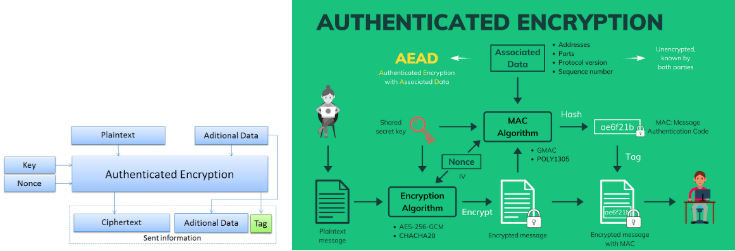

## AES GCM

## AES PRF RNG
Use aes gcm as PRF RNG, randomly produce the random seeds (including its keys), and produce random hex of N bytes, and plot the distribution.

The y-axis value of 0.004 on the histogram corresponds to the probability density of each byte value in the random output. This is due to the density=True argument in the plt.hist(), which normalizes the histogram.

Probability Density:
The y-axis value represents the proportion of occurrences of each byte value (0-255) scaled by the total number of samples.

For example, a value of 0.004 means that approximately 0.4% of the generated bytes fall within that bin (a specific byte value).

Expected Uniform Distribution:
Since AES-GCM is a cryptographically secure PRF, the byte distribution should ideally be uniform. For 256 possible byte values, each byte should appear with approximately equal likelihood.

Given that the total probability sums to 1, the expected value for each byte is:

Expected Density
=1/256
≈ 0.0039

Seeing 0.004 is consistent with a uniform distribution.

Variations:
Small deviations from 0.0039 are normal due to randomness.
Large deviations may suggest bias or a problem with the randomness.

## AES Log Exclusive Access
Create aes_log_exclusive_access where each user can only access his/her own logs.

User Registration: Each user is assigned a unique AES key.

Logging: When a user polls the server, their activity is logged with both Linux timestamp and human-readable format.

Encryption: Logs are encrypted using the user's AES key and saved in individual files.

Access Control: Each user can only access their own logs by decrypting with their AES key.

## CMAC and SHA-256
Hash and Hmac (with CMAC)

## AES GCM Ciphering
Associated Data (AAD): The data for port, address, sequence number, and timestamp is concatenated into a single byte string and used for authentication. Concatenate the values for address, port, sequence number, and timestamp into a single byte string.

authenticate_additional_data: Method is called on the encryptor to include the associated data, which will be authenticated but not encrypted.

AES-GCM Encryption: The provided data is encrypted with the AES-GCM mode. The encryptor.authenticate_additional_data() method ensures that the associated data is authenticated but not encrypted.

Return Values: The function returns both the ciphertext and the tag, which is needed for decryption and verification of the integrity of the data.

✅ Stable Timestamp: The timestamp used in encryption is reused in decryption to ensure the AAD matches.

✅ Authenticated Encryption: AES-GCM protects both confidentiality and integrity with the AAD and the authentication tag.