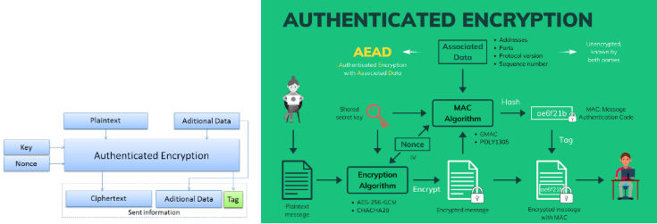
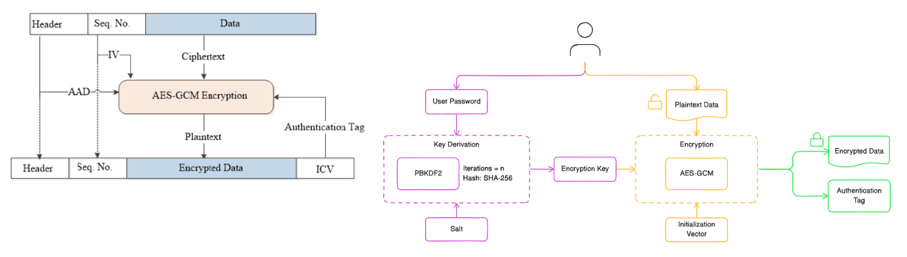
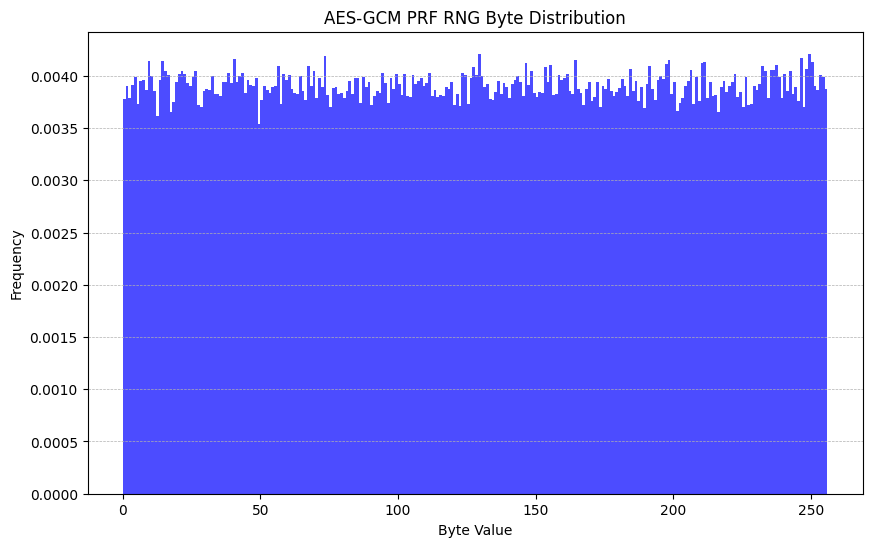
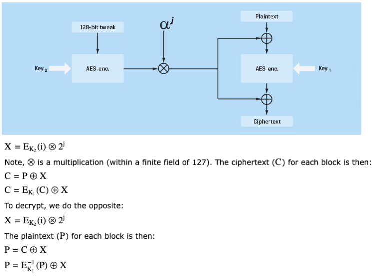
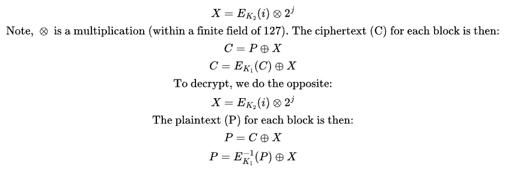
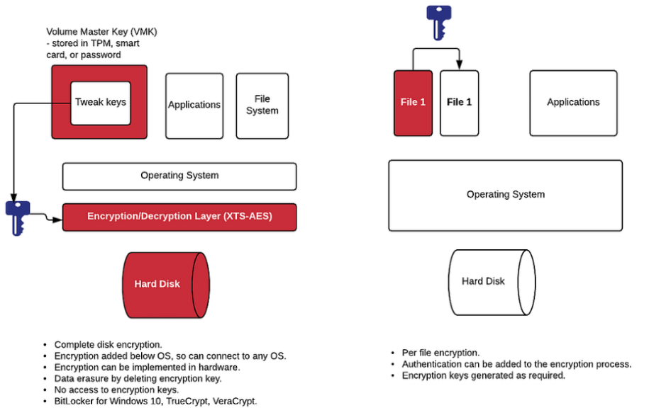
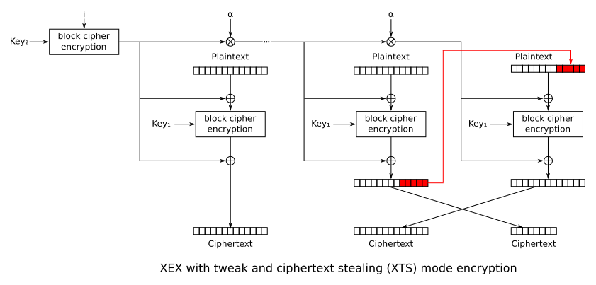

## AES GCM




## AES PRF RNG
Use aes gcm as PRF RNG, randomly produce the random seeds (including its keys), and produce random hex of N bytes, and plot the distribution.

The y-axis value of 0.004 on the histogram corresponds to the probability density of each byte value in the random output. This is due to the density=True argument in the plt.hist(), which normalizes the histogram.

Probability Density:
The y-axis value represents the proportion of occurrences of each byte value (0-255) scaled by the total number of samples.

For example, a value of 0.004 means that approximately 0.4% of the generated bytes fall within that bin (a specific byte value).

Expected Uniform Distribution:
Since AES-GCM is a cryptographically secure PRF, the byte distribution should ideally be uniform. For 256 possible byte values, each byte should appear with approximately equal likelihood.

Given that the total probability sums to 1, the expected value for each byte is:

Expected Density
=1/256
≈ 0.0039

Seeing 0.004 is consistent with a uniform distribution.

Variations:
Small deviations from 0.0039 are normal due to randomness.
Large deviations may suggest bias or a problem with the randomness.




## AES Log Exclusive Access
Create aes_log_exclusive_access where each user can only access his/her own logs.

User Registration: Each user is assigned a unique AES key.

Logging: When a user polls the server, their activity is logged with both Linux timestamp and human-readable format.

Encryption: Logs are encrypted using the user's AES key and saved in individual files.

Access Control: Each user can only access their own logs by decrypting with their AES key.


## CMAC and SHA-256
Hash and Hmac (with CMAC)

## AES GCM Ciphering
Associated Data (AAD): The data for port, address, sequence number, and timestamp is concatenated into a single byte string and used for authentication. Concatenate the values for address, port, sequence number, and timestamp into a single byte string.

authenticate_additional_data: Method is called on the encryptor to include the associated data, which will be authenticated but not encrypted.

AES-GCM Encryption: The provided data is encrypted with the AES-GCM mode. The encryptor.authenticate_additional_data() method ensures that the associated data is authenticated but not encrypted.

Return Values: The function returns both the ciphertext and the tag, which is needed for decryption and verification of the integrity of the data.

✅ Stable Timestamp: The timestamp used in encryption is reused in decryption to ensure the AAD matches.

✅ Authenticated Encryption: AES-GCM protects both confidentiality and integrity with the AAD and the authentication tag.

## AES XEX and XTS Intro
XEX, XTS: define 2 keys (K1 and K2). If we use 128-bit AES, then we generate two keys which are 128 bits long. Next, we define an input block (P) and a sector number (i) and a block number (j), and create a tweak (X ):


The parameters are the encryption key, and the sector number, in order to encrypt and decrypt. 
The tweak acts as an IV.






```
X = E_{K_2}(i) \otimes 2^j \\
\text{Note, } \otimes \text{ is a multiplication (within a finite field of 127). The ciphertext (C) for each block is then:} \\
C = P \oplus X \\
C = E_{K_1}(C) \oplus X \\

\text{To decrypt, we do the opposite:} \\
X = E_{K_2}(i) \otimes 2^j \\
\text{The plaintext (P) for each block is then:} \\
P = C \oplus X \\
P = E^{-1}_{K_1}(P) \oplus X

```

## AES XEX Ciphering
AES-XEX (Xor-Encrypt-Xor) mode is a tweakable encryption mode often used for disk encryption. It works similarly to AES-ECB but introduces a tweak value to diversify ciphertexts for the same plaintext.



1. Tweak: Random 16-byte value that makes the same plaintext encrypted differently each time.

2. Encryption Flow:
Encrypt the tweak using AES.
XOR the plaintext with the encrypted tweak.
Encrypt the result.
XOR the ciphertext with the encrypted tweak again.

3. Decryption Flow: Reverse the encryption process.

### Security Considerations:
Always use a random tweak for each encryption operation.

Ensure that the key size matches the AES mode (128, 192, or 256 bits).

AES-XEX provides semantic security if the tweak is unique for each block.

## AES XTS Ciphering
AES-XTS (XEX-based Tweaked CodeBook mode with ciphertext stealing) is a widely-used encryption mode designed for encrypting data on storage devices. It is more advanced than XEX because it handles data lengths that are not a multiple of the block size.

A sector of a size of 512 bytes will store 32, 16-byte AES-blocks (a block in AES is 128 bits long). In this way, for a single sector, we call the encrypt/decrypt method 32 times using the same i value, but different j values (0 to 31).

Most fully encrypted disks use the AES-XTS block cipher mode, and which is defined in IEEE Standard 1619. It is now implemented in many USB encrypted devices, and with Microsoft Bitlocker for Windows 10, TrueCrypt, VeraCrypt, OpenSSL, and Mac OSX FileVault.




AES-XTS Requirements:
Key: 2 separate 256-bit (32-byte) keys (total: 512-bit key).

Tweak: A 128-bit (16-byte) tweak value, typically derived from the sector number.

Encryption Process:
XTS encrypts each block of plaintext with a tweak based on the sector number.

Ciphertext stealing allows handling of plaintexts that aren't a multiple of the block size.

Decryption Process:
Mirrors encryption, using the same keys and tweak.

Ensure the same sector number (tweak) is provided.

### Security Considerations:
Always use unique sector numbers (or other tweaks) to prevent ciphertext reuse.

Ensure 512-bit key (two 256-bit keys) for AES-XTS.

Caveat: XTS weaknesses exists. XTS mode is susceptible to data manipulation and tampering. It is not suitable for message encryption—use it primarily for disk encryption.


